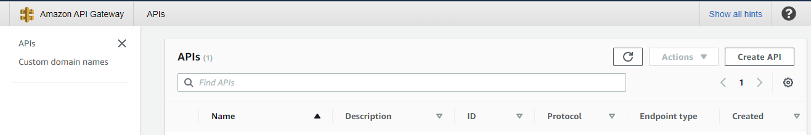
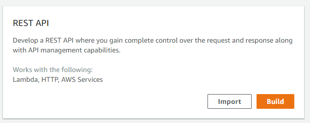
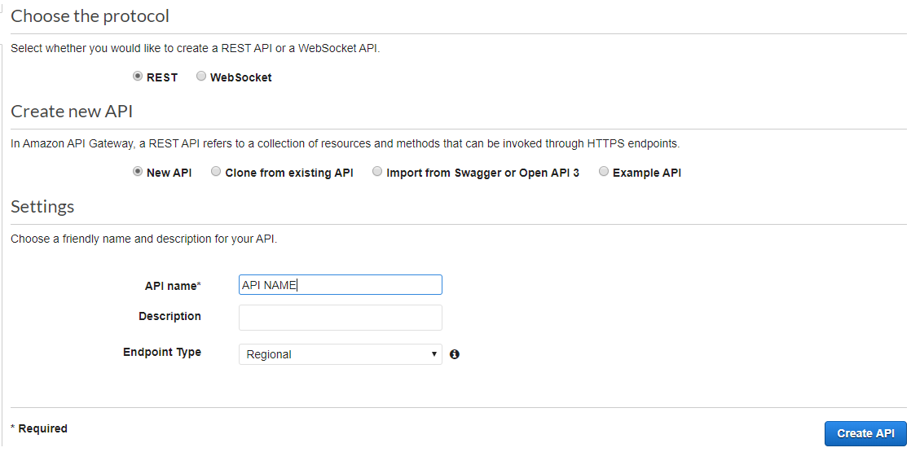
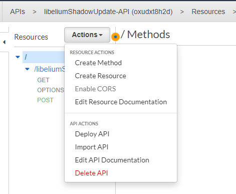
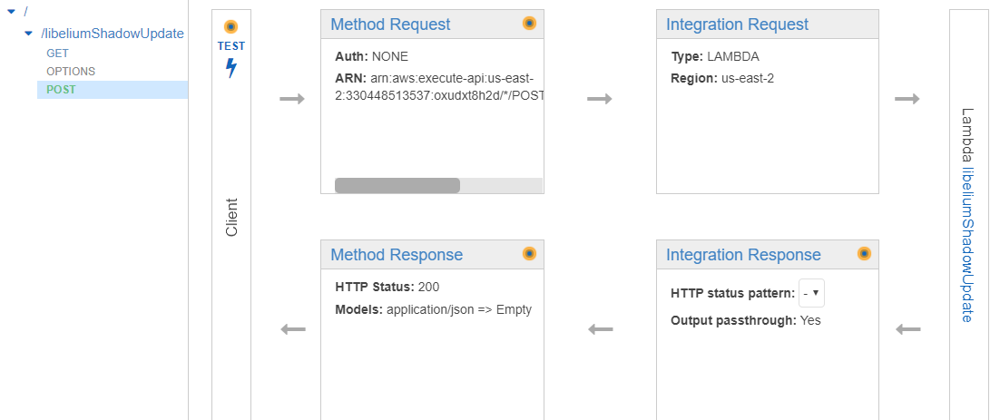
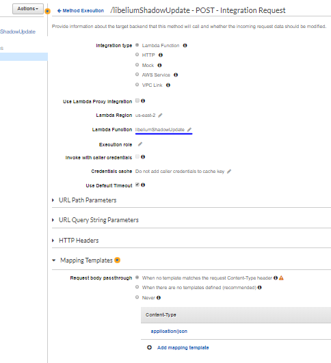

# API Gateway

An API gateway sits in front of an application programming interface (API) and acts as a single point of entry for a defined group of microservices. This is because, in addition to accommodating direct requests, gateways can be used to invoke multiple back-end services and aggregate the results.

## Usecase scenario in this project

API gateway recieves the data sent by Libelium and depending on its form and type forwards it to lambda function.

## Setup Instructions

1. Creation: In order to create new API gateway, go to your [AWS API gateway Console]("https://aws.amazon.com/api-gateway/") and press "Create API" button in the top right.

    

2. Choose API type:

    

3. API parameters: Choose REST protocol, and give it a name...

    

4. Create method:

    

5. POST method settings:

    

6. Integration request options:

    
    - this is where you choose what happens when the API is called. In "Lambda Function" field select the lambda that was created to do the desired task from the dropdown menu
    - In Mapping Templates choose eather the first option.

7. Deploy the API:

    
    - when everithing is set up, go to the "Actions" dropdown and select "Deploy API", if you are deploying for the first time you are going to be asked to name a new stage, just give some meaningfull name (ex. production) and proceed.
