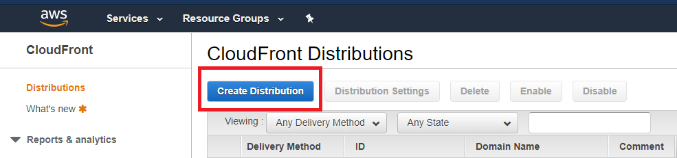
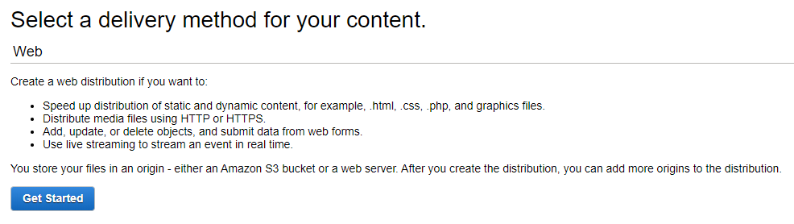
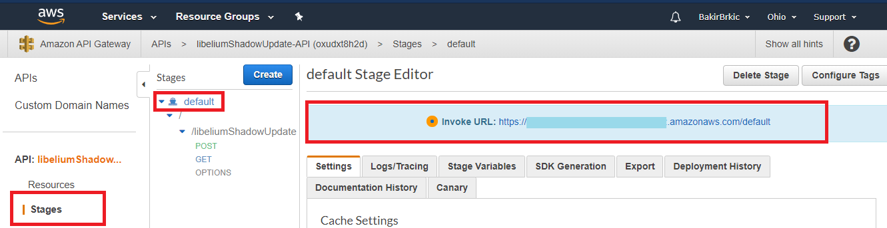
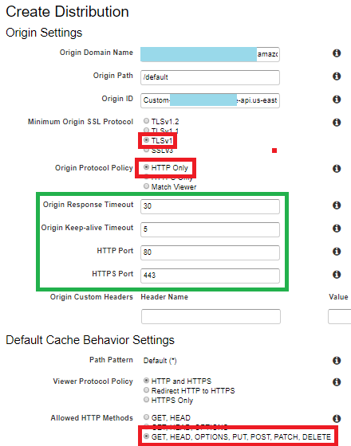

# CloudFront

Amazon CloudFront is used as a global content delivery network service. The AWS CloudFront delivers data, videos, applications, and APIs to the viewers with low latency and high transfer rates.

## Usecase for this project

CloudFront serves as the endpoint to which Libelium sends HTTP request with data that needs to be securely forwarded onto API gateway.

## Setup instructions

1. Open CloudFront Consol

2. Press "Create Distribution" button

    

3. Select Distribution type

    

4. In new tab go to API gateway console

    
    - go to "Stages" section
    - select your stage (in this case default)
    - copy the path of your API gateway

5. Go back to Distribution creation form and fill in the data

    
    - into Origin Domain Name paste the path to your API, 2 fields below are going to be populated automatically
    - set all the options as marked in red
    - fields in green are going to be set by default

6. Press "Create distribution" and wait for it to be deployed.
