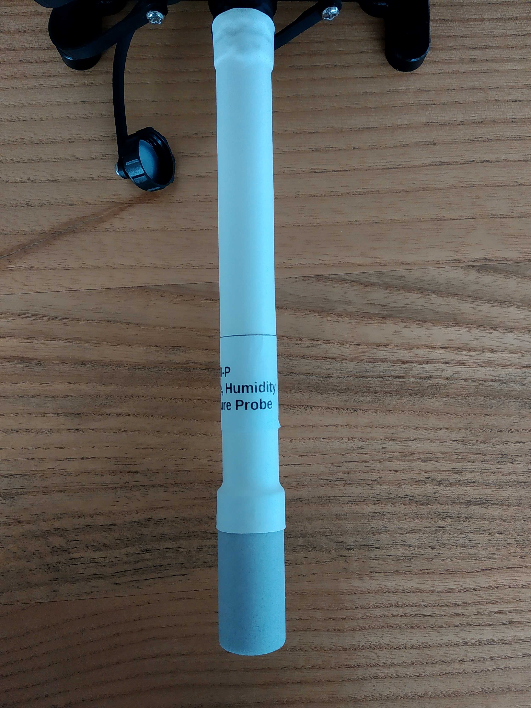

# Libelium Plug & Sense

Every _plug and sense_ device has 6 sensor sockets, power cable socket, USB socket and depending of the configuration additional sockets for communication antenas, SIM cards, etc.

**power button, USB plug, power socket**

**6 sensor sockets**

## Plug & Sense Smart Environment PRO

For this project we used **Waspmote** version _plug and sense_ **Smart Environment PRO**.

Our unit is configured to use only Wi-Fi for communication.

## Sensors

We are using Libelium **BME sensor** module for monitoring of air **temperature**, air **pressure** and air **humidity**.

## Additional gear

Bundled with _Plug & Sense Smart Environment PRO_ came **solar panel** and suitable power cable.

## Mounting options

_Libelium plug & sense_ can be mounted eather to the wall by fixing it with the bolts, or tied to the pole (example street light pole) by using provided metal ties.

## Official information

More information on sensors, products and documentation can be found on [Libelium website.](http://www.libelium.com/products/plug-sense/)
